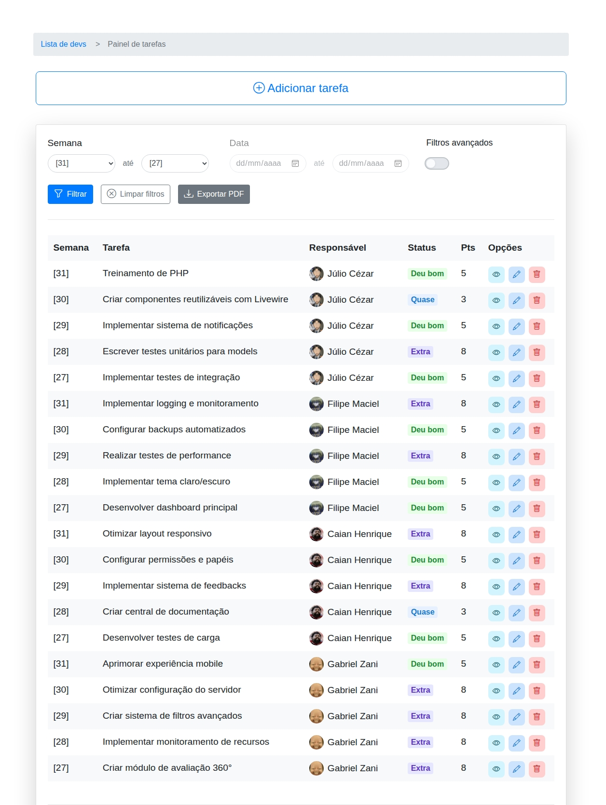
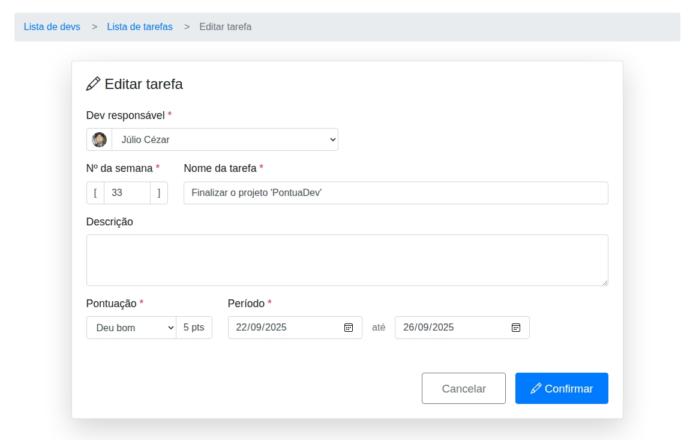

<h2>Changelog</h2>

  <h2 style="display: inline-block;">
    <a href="https://github.com/juletopi/PontuaDev_Project/releases/tag/v1.0">[v1.0]</a> - 10/10/2025
  </h2>

<h3>Adicionado</h3>

  <h4>Interface de gerenciamento de desenvolvedores</h4>
  

<h4>Gerenciar desenvolvedores</h4>

- Card de listagem dos devs com as informações de avatar, faixa, nome, cargo, experiência, email
- Botões de ações: Editar e Deletar
- **Collapse no card de listagem dos devs**:
  - Métricas de Pontuação: Média geral de pontos, Total de pontos e Porcentagem de aproveitamento
  - Lista de Tarefas com colunas para Semana, Nome, Status e Pontos (0-8)
  - Botão "Ver mais" para acesso à interface de gerenciamento completo

<table>
  <tr>
    <td width="50%">
      
      <h4 align="center">Adicionar desenvolvedor</h4>
      <ul>
        <li>Botão "Adicionar dev" que abre um formulário de cadastro</li>
        <li>Formulário com drag and drop para avatar</li>
        <li>Campos para nome, cargo, email e experiência</li>
        <li>Seleção de faixa por cores (branca até preta)</li>
      </ul>
    </td>
    <td width="50%">
      
      <h4 align="center">Editar desenvolvedor</h4>
      <ul>
        <li>Botão "Editar" que abre o formulário de edição</li>
        <li>Formulário pré-preenchido com dados atuais</li>
        <li>Atualização instantânea após confirmação</li>
      </ul>
    </td>
  </tr>
  <tr>
    <td>
      
      <h4 align="center">Excluir desenvolvedor</h4>
      <ul>
        <li>Botão "Deletar" com modal de confirmação</li>
        <li>Proteção contra exclusões acidentais</li>
      </ul>
    </td>
  </tr>
</table>

  <h4>Interface de gerenciamento de tarefas</h4>
  

<h4>Gerenciar tarefas</h4>

- Tabela completa com ordenação e filtros
- Visualização de todas as tarefas do sistema
- Ações disponíveis por tarefa: Ver, Editar e Deletar

<table>
  <tr>
    <td width="50%">
      
      <h4 align="center">Adicionar tarefa</h4>
      <ul>
        <li>Botão "Adicionar tarefa" na interface</li>
        <li>Seleção do desenvolvedor responsável</li>
        <li>Campos para semana, nome, descrição e período</li>
        <li>Opções de status e pontuação configuráveis</li>
      </ul>
    </td>
    <td width="50%">
      
      <h4 align="center">Editar tarefa</h4>
      <ul>
        <li>Formulário pré-preenchido com dados atuais</li>
        <li>Modificação de qualquer propriedade</li>
        <li>Atualização instantânea após confirmação</li>
      </ul>
    </td>
  </tr>
  <tr>
    <td>
      
      <h4 align="center">Ver detalhes</h4>
      <ul>
        <li>Botão "Ver" que abre modal com detalhes</li>
        <li>Visualização completa de informações</li>
        <li>Descrição e período da tarefa</li>
      </ul>
    </td>
    <td>
      
      <h4 align="center">Excluir tarefa</h4>
      <ul>
        <li>Modal de confirmação para exclusão</li>
        <li>Proteção contra exclusões acidentais</li>
      </ul>
    </td>
  </tr>
</table>

  <h4>Amostragem dinâmica de dados de Pontuação e Tarefas</h4>
  

<h4>Métricas de desenvolvedores</h4>

- Mini-avatar do desenvolvedor para identificação rápida
- **Métricas detalhadas**:
  - Média ponderada de pontos por período
  - Total de pontos acumulados
  - Porcentagem de aproveitamento (desempenho)
- **Distribuição visual por status**:
  - Quantificação de cada categoria (Zerou → Extra)
  - Total de tarefas por desenvolvedor
  - Comparativo de ranking entre desenvolvedores

  <h4>Filtragem básica e avançada</h4>
  

<h4>Filtros básicos e avançados</h4>

- **Filtros temporais**:
  - Seleção de semana inicial e final
  - Campos de data para períodos personalizados
- **Filtros por atributos**:
  - Status: Checkboxes para múltiplos status (Zerou, Saiu algo, Quase, Deu bom, Extra)
  - Responsável: Seleção múltipla de desenvolvedores
- **Ações disponíveis**:
  - Aplicar filtros: Atualização da tabela com critérios selecionados
  - Limpar filtros: Reset para visão padrão (tarefa mais recente de cada dev)
  - Exportar PDF: Relatório completo com dados filtrados

<h3>Configurado</h3>

- Configuração inicial do projeto com Laravel 12
- Configuração do banco de dados PostgreSQL
- Configuração do ambiente com .env.example
- Configuração do composer.json e dependências iniciais
- Configuração do package.json e dependências iniciais
- Configuração do README com instruções de instalação e uso
- Configuração do CHANGELOG para controle de versões
- Configuração do LICENSE com licença Creative Commons BY-NC 4.0

