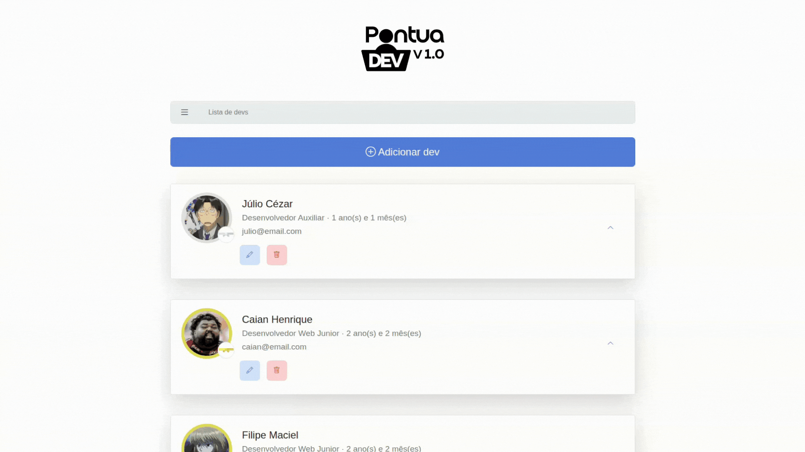

<!--
References used in this Repository
https://github.com/kyechan99/capsule-render
https://github.com/DenverCoder1/custom-icon-badges
https://github.com/alexandresanlim/Badges4-README.md-Profile
https://shields.io
https://getemoji.com
-->

<!-- PRESENTATION -->

<div align="center">
  <a href="">
    
  </a>
  <h2 align="center">PontuaDev</h2>
</div>

<div align="center">
  <a href="https://laravel.com/">
    
  </a>
  <a href="https://www.php.net/">
    
  </a>
  <a href="https://getbootstrap.com/">
    
  </a>
  <a href="https://jquery.com/">
    
  </a>
</div>

<br>

<div align="center">
  <a href="#sobre-o-projeto">Sobre</a> &#xa0; • &#xa0;
  <a href="#changelog">Changelog</a> &#xa0; • &#xa0;
  <a href="#contribuições">Contribuições</a> &#xa0; • &#xa0;
  <a href="#instalação">Instalação</a> &#xa0; • &#xa0;
  <a href="#licença">Licença</a>
</div>

----

  <div align="center">
    <p>
      
    </p>
  </div>

<!-- ABOUT THE PROJECT -->

## Sobre o projeto

O **PontuaDev** é um sistema web de gerenciamento para equipes de desenvolvimento, focado na organização de tarefas, acompanhamento de desempenho e incentivo à produtividade.

A aplicação permite gerenciar desenvolvedores e suas atividades de forma estruturada, combinando conceitos da **metodologia XP (Extreme Programming)** com práticas de **gamificação**, como pontuação e rankings, tornando o fluxo de trabalho mais dinâmico e motivador.

A **metodologia XP** é uma abordagem ágil baseada em ciclos curtos e entregas contínuas. No contexto do PontuaDev, ela é aplicada por meio de **tarefas semanais**, com diferentes níveis de dificuldade e pontuação associada ao completá-las, incentivando consistência, evolução e entrega frequente.

Já a **gamificação** atua como um fator motivacional: desenvolvedores acumulam **pontos** ao concluir tarefas e, ao final de cada ciclo, são posicionados em um **leaderboard**, promovendo engajamento e uma competitividade saudável dentro da equipe.

Com o PontuaDev, é possível:

- **Gerenciar desenvolvedores** com cadastro de informações detalhadas  
- **Organizar tarefas** com definição de responsabilidades e pontuação  
- **Acompanhar o desempenho** individual e coletivo por meio de métricas  
- **Controlar prazos e entregas**, facilitando o planejamento das atividades  
- **Incentivar a produtividade** com sistema de pontuação e ranking

### Tecnologias utilizadas

<a href="https://laravel.com/">
  
</a>
<a href="https://getbootstrap.com/">
  
</a>
<a href="https://icons.getbootstrap.com/">
  
</a>
<a href="https://jquery.com/">
  
</a>

#### Leia a documentação traduzida para outros idiomas:

<table>
  <tr>
    <th align="center">Idiomas</th>
    <th align="center">Link</th>
  </tr>
  <tr>
    <td>
       
      Português (Brasil)
    </td>
    <td align="center">
      <a href="https://github.com/juletopi/PontuaDev_Project/blob/master/README.md">README.md</a>
    </td>
  </tr>
  <tr>
    <td>
       
      English
    </td>
    <td align="center">
      <a href="docs/translations/README.en.md">README.en.md</a>
    </td>
  </tr>
  <tr>
    <td>
       
      Español
    </td>
    <td align="center">
      <a href="docs/translations/README.es.md">README.es.md</a>
    </td>
  </tr>
</table>

<div align="left">
  <h6><a href="#pontuadev"> Voltar para o início ↺</a></h6>
</div>

<!-- CHANGELOG -->

## Changelog

O projeto mantém um histórico de alterações detalhado para cada versão, incluindo:

- Novas funcionalidades adicionadas
- Alterações em funcionalidades existentes
- Correções de bugs
- Visualizações da interface com capturas de tela

Consulte o [CHANGELOG.md](CHANGELOG.md) para ver o histórico completo de alterações e capturas de tela da interface.

<div align="left">
  <h6><a href="#pontuadev"> Voltar para o início ↺</a></h6>
</div>

<!-- CONTRIBUTIONS -->

## Contribuições

Contribuições ao projeto são bem vindas! \
Se você deseja contribuir para este projeto, há várias maneiras de fazer isso. Você pode:
- Reportar bugs ou problemas;
- Propor novos recursos ou melhorias;
- Ajudar a melhorar a documentação;
- Compartilhar o projeto com outras pessoas.

Consulte o guia [CONTRIBUTING.md](https://github.com/juletopi/PontuaDev_Project/blob/master/CONTRIBUTING.md) para saber mais sobre como contribuir.

<div align="left">
  <h6><a href="#pontuadev"> Voltar para o início ↺</a></h6>
</div>

<!-- INSTALLATION -->

## Instalação

> [!IMPORTANT]  
> Certifique-se de ter os seguintes requisitos antes de iniciar:
>
> <a href="https://www.php.net/">
>   
> </a>
> <a href="https://getcomposer.org/">
>   
> </a>
> <a href="https://www.postgresql.org/">
>   
> </a>

1. Clone o repositório
```bash
git clone https://github.com/seu-usuario/pontuadev.git
cd pontuadev
```

2. Instale as dependências do PHP
```bash
composer install
```

3. Copie o arquivo de ambiente
```bash
cp .env.example .env
```

4. Configure o banco de dados no arquivo `.env`

> [!NOTE]  
> Você pode escolher entre PostgreSQL (recomendado para produção) ou SQLite (mais simples para testes).

Opção com PostgreSQL:
```
DB_CONNECTION=pgsql
DB_HOST=127.0.0.1
DB_PORT=5432
DB_DATABASE=pontuaDev
DB_USERNAME=seu_usuario
DB_PASSWORD=sua_senha
```

Opção alternativa com SQLite (mais simples para testes):
```
DB_CONNECTION=sqlite
DB_DATABASE=/caminho/absoluto/para/database.sqlite
```

Se escolher SQLite, crie o arquivo vazio com o comando:
```bash
touch database/database.sqlite
```

5. Gere a chave da aplicação
```bash
php artisan key:generate
```

6. Execute as migrations para criar as tabelas do banco de dados
```bash
php artisan migrate
```

> [!TIP]  
> Opcionalmente, você pode popular o banco com dados de exemplo:
> ```bash
> php artisan db:seed
> ```
> Ou fazer ambos em um único comando:
> ```bash
> php artisan migrate --seed
> ```

7. Inicie o servidor
```bash
php artisan serve
```

<div align="left">
  <h6><a href="#pontuadev"> Voltar para o início ↺</a></h6>
</div>

<!-- LICENSE -->

## Licença

Este projeto está licenciado sob uma licença personalizada que permite uso e modificação privada, mas **proíbe uso comercial**. Veja o arquivo [LICENSE](https://github.com/juletopi/PontuaDev_Project/blob/master/LICENSE) para mais detalhes.

Para uso comercial deste software, entre em contato com o autor em juliocezarpvh@hotmail.com.

<div align="left">
  <h6><a href="#pontuadev"> Voltar para o início ↺</a></h6>
</div>

<br>

<!-- AUTHOR -->

## Autor

<table>
  <tr>
    <td valign="middle" width="25%">
      <div align="center">  
        <a href="https://github.com/juletopi" title="Perfil no GitHub" aria-label="GitHub - Juletopi">
          
          <br>
          <sub><strong>Júlio Cézar | Juletopi</strong></sub>
          <br>
        </a>
      </div>
    </td>
    <td valign="middle" width="75%">
      <ul style="list-style: none; padding-left: 0; margin: 0;">
        <li>
          
          LinkedIn — 
          <a href="https://www.linkedin.com/in/julio-cezar-pereira-camargo/" target="_blank" rel="noopener noreferrer" aria-label="LinkedIn - Júlio Cézar P. Camargo">
            Júlio Cézar P. Camargo
          </a>
        </li>
        <li>
          
          Email — 
          <a href="mailto:juliocezarpvh@hotmail.com" aria-label="Send email - juliocezarpvh@hotmail.com">
            juliocezarpvh@hotmail.com
          </a>
        </li>
        <li>
          
          Facebook — 
          <a href="https://www.facebook.com/juhletopi" target="_blank" rel="noopener noreferrer" aria-label="Facebook - Juhletopi">
            facebook.com/juhletopi
          </a>
        </li>
        <li>
          
          Instagram — 
          <a href="https://www.instagram.com/juletopi/" target="_blank" rel="noopener noreferrer" aria-label="Instagram - Juletopi">
            @juletopi
          </a>
        </li>
      </ul>
    </td>
  </tr>
  <tr>
    <td colspan="2" align="center">
      
      Portfolio —
      <a href="https://juletopi.github.io/JCPC_Portfolio/" target="_blank" rel="noopener noreferrer" aria-label="Portfolio - Juletopi">
        juletopi.github.io/JCPC_Portfolio
      </a>
    </td>
  </tr>
</table>

<div align="left">
  <h6><a href="#pontuadev"> Voltar para o início ↺</a></h6>
</div>

<br>

<!-- THANK YOU, GOODBYE -->

----

<div align="center">
  Feito com ❤️ e ☕ por <a href="https://github.com/juletopi"> Juletopi</a>.
</div>
